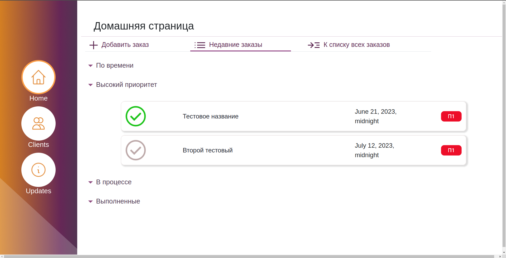
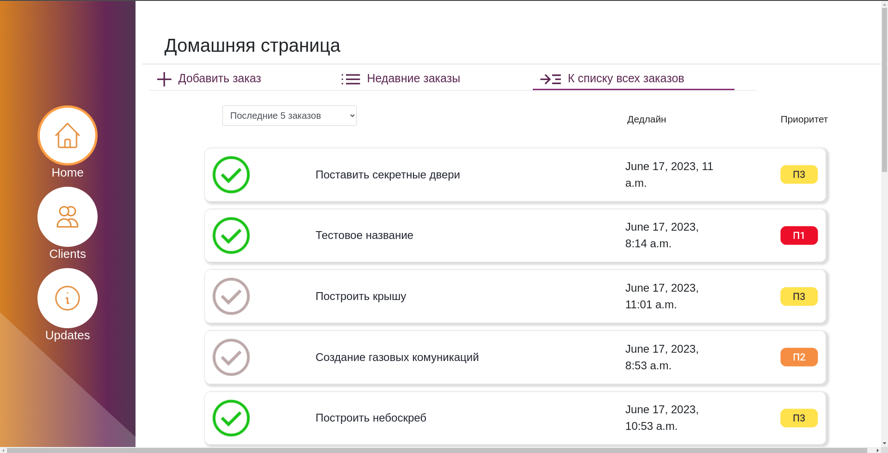
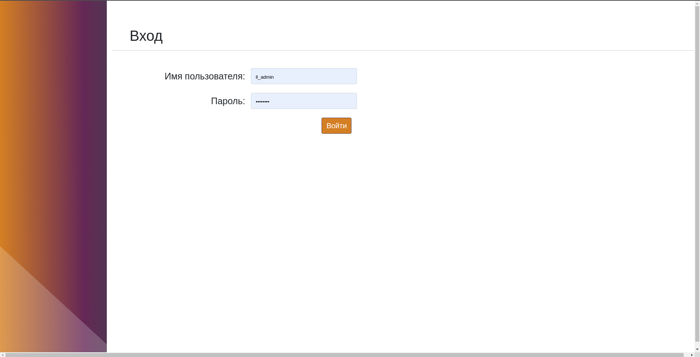

# CRM система для строительной компании

## Задача
1. Разработать дизайн crm системы
2. Разработать backend crm системы для управления бизнесом на языке python, с использованием фреймворков django, bootstrap.
3. Разработать frontend crm

## Примеры реализованного frontend

